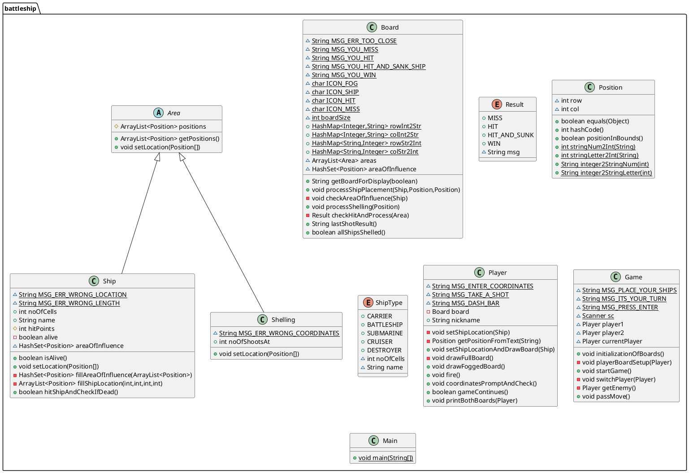

# Battleships!
Hyperskill project for Java

Project definition can be found  [here](https://hyperskill.org/projects/125).

### UML Structure
Game class is to start playing Battleships.
It generates two Players. 

Each has its own Board. 
Board is filled with Ships or Shellings that inherit from Area. 
Location is represented by Position class. 

Details are visible below:





[//]: # (> This sample is a part of the [codeSnippets]&#40;../../README.md&#41; Gradle project.)
[//]: # ()
[//]: # ()
[//]: # ()
[//]: # (```bash)

[//]: # ()
[//]: # (./gradlew :tutorial-server-get-started:run)

[//]: # ()
[//]: # (```)